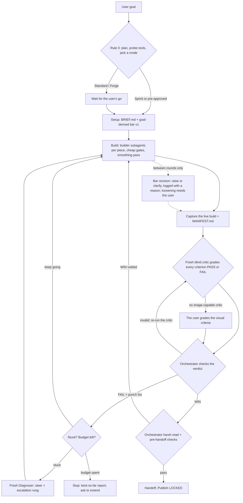

# forge-protocol-skill (`forge-protocol`)

An agent skill for building demos, 3D scenes, browser games, simulations, web UIs and data viz to a high bar. A lead agent turns the user's goal into a versioned PASS/FAIL bar, splits the work across builder subagents, and loops captures of the running build past a **fresh blind critic** until the bar is met, a budget runs out, or the user stops it.

The skill is **instructions only**. It bundles no code and assumes no particular agent: each agent uses the tools its environment provides, and writes and verifies any small tool it needs (a capture script, a comparison image, a progress page) inside the project.

## Install

Copy the `forge-protocol/` folder into wherever your agent loads skills from.

## How it works



| | Sprint | Standard | Forge |
| :--- | :--- | :--- | :--- |
| Use for | a quick demo or one screen | a polished demo or small game | multi-hour worlds, games, showcase pieces |
| Plan gate | short plan, then start | plan, wait for a go | full plan, wait for a go |
| Default budget | 3 rounds, 30 min | 8 rounds, 2 h | 25 rounds, 8 h |
| Check-ins | at the end | every 3 rounds or 45 min | every 5 rounds or 90 min |

What it guards against:

1. **Building before alignment**: Rule 0 puts a plan, a live tool probe and the bar in front of the user first. The gate scales with the mode, and an explicit pre-approval skips the wait.
2. **Self-grading**: builders never judge their own work. Every grade comes from a fresh critic that sees only the brief, the bar and the captures, or from the user when no critic can view images.
3. **Soft passes and score inflation**: every criterion is binary PASS or FAIL with cited evidence. The orchestrator rejects verdicts with soft-pass language, grading scores, ungraded criteria or uncited stills, and re-runs the critic instead of editing.
4. **Moving goalposts**: the bar comes from the goal and is versioned as a ratchet. It can rise between rounds with a logged reason, never mid-round, and it never drops without the user's explicit approval.
5. **Thrashing and runaway runs**: stuck criteria trigger a fresh Diagnoser and an escalation ladder; budgets, check-ins and an optional progress page keep long runs bounded and visible.

3D work runs through Blender, live over MCP or as headless workers, into Three.js/WebGPU or Unity, with a turnaround gate for every hero asset. Publishing stays locked until the user unlocks it, and third-party assets ship only under a license that allows it.

## Layout

```text
forge-protocol-skill/
  README.md                   this file
  LICENSE                     MIT license for the repo
  forge-protocol/             the skill
    SKILL.md                  modes, Rule 0, roles, the bar, the loop, handoff, non-negotiables
    LICENSE                   MIT license, shipped with the skill
    references/
      project-files.md        layout, file skeletons, log, manifest and handback formats
      visual-bar.md           writing criteria, the shared core, the ratchet, automatic FAIL signs
      criteria-packs.md       3D, web UI, data viz, 2D and interactive criteria starters and levers
      critic-prompt.md        drop-in critic prompt, verdict formats, verdict check, grading by the user
      diagnoser-prompt.md     stuck-loop triggers, escalation ladder, Diagnoser prompt
      capture-and-tools.md    capture discipline and the tools an agent writes and verifies itself
      pipelines.md            picking a stack; Blender live or headless into Three.js/WebGPU or Unity
      threejs/                Three.js module: router.md plus 17 topic files, read through the router
```

## License

MIT. See [LICENSE](LICENSE).

Inspired by Eric Zakariasson's [game-builder skills](https://github.com/ericzakariasson/skills) and Matt Shumer's [Gauntlet Loop](https://somethingbig.ai/gauntlet-loop).
