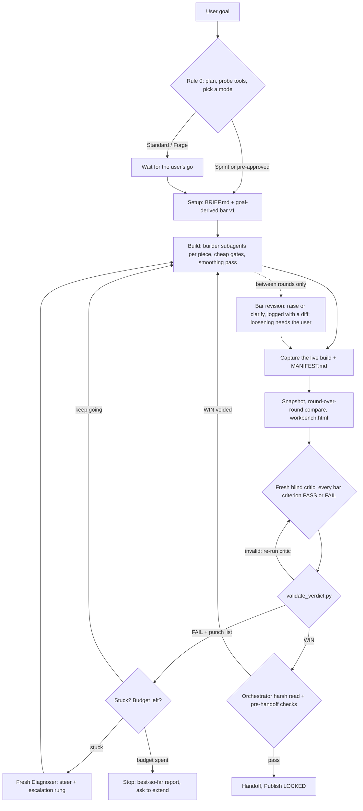

# forge-protocol-skill (`forge-protocol`)

An agent skill for building demos, 3D scenes, browser games, simulations, web UIs and data viz to a high bar. A lead agent turns the user's goal into a versioned PASS/FAIL bar, splits the work across builder subagents, and loops captures of the running build past a **fresh blind critic** until the bar is met, a budget runs out, or the user stops it. **Sprint**, **Standard** and **Forge** modes scale the ceremony from a half-hour demo to a multi-hour build. It supports **Blender** (live MCP or headless `.glb` workers) feeding **Three.js / WebGPU** or **Unity 6** via Unity MCP, and ships tested tools for scaffolding, verdict validation, round-over-round comparison and a live **workbench** page.

---

## Install

Copy or symlink `forge-protocol/` into your agent's skills directory.

Requirements: Python 3.9+ for the scripts and ffmpeg for `make_sxs.py`. Optional: Node 18+ with Playwright for web capture, Blender for 3D assets, and Unity 6 with `com.unity.ai.assistant` for Unity builds.

---

## Architecture



| | Sprint | Standard | Forge |
| :--- | :--- | :--- | :--- |
| Use for | a quick demo or one screen | a polished demo or small game | multi-hour worlds, games, showcase pieces |
| Plan gate | short plan, then start | plan, wait for a go | full plan, wait for a go |
| Default budget | 3 rounds, 30 min | 8 rounds, 2 h | 25 rounds, 8 h |
| Check-ins | at the end | every 3 rounds or 45 min | every 5 rounds or 90 min |

---

## Why This Skill Exists (Five Failure Modes It Eliminates)

1. **Building before alignment**: Rule 0 puts a plan, a tool probe and the bar in front of the user first. The gate scales with the mode, and an explicit pre-approval skips the wait.
2. **Self-grading**: builders never judge their own work. Every grade comes from a fresh critic that sees only the brief, the bar and the captures, never builder chat.
3. **Soft passes and score inflation**: every criterion is binary PASS or FAIL with cited evidence. `validate_verdict.py` rejects banned soft-pass phrases, numeric scores, ungraded criteria, uncited stills and invented still ids.
4. **Moving goalposts**: the bar is goal-derived and versioned as a ratchet. It can rise between rounds with a logged reason and diff, never mid-round, and it never drops without the user's explicit approval.
5. **Thrashing and runaway runs**: stuck criteria trigger a fresh Diagnoser and the escalation ladder; budgets, check-ins and the live workbench keep long runs bounded and visible.

---

## Layout

```text
forge-protocol-skill/
  README.md                         this file
  LICENSE                           MIT license for the repo
  tests/                            stdlib unittest suite (python3 -m unittest discover -s tests)
  forge-protocol/                   the skill
    SKILL.md                        modes, Rule 0, roles, the bar, the loop, handoff, non-negotiables
    LICENSE                         MIT license, shipped with the skill
    THIRD_PARTY_NOTICES.md          upstream license text
    references/
      visual-bar.md                 writing criteria, the shared core, the bar ratchet, auto-FAIL signs
      criteria-packs.md             3d, web-ui, dataviz, 2d and interactive criteria starters and levers
      critic-prompt.md              drop-in critic prompt and every verdict schema
      diagnoser-prompt.md           stuck-loop triggers, escalation ladder, Diagnoser prompt
      unity-and-blender-pipelines.md  Blender MCP, headless Blender, web capture, Unity MCP
    scripts/
      forge.py                      init, log, bar publish/diff, snapshot, manifest, status, build-id
      forgelib.py                   shared formats (paths, rounds.log, BAR.md and verdict parsing)
      validate_verdict.py           verdict gate
      make_sxs.py                   round-over-round composites, blur, detail tiles, blind A/B (ffmpeg)
      make_workbench.py             self-refreshing artifacts/workbench.html
      blender_mcp_cli.py            live Blender client (blender-mcp addon socket, localhost:9876)
      blender_turnaround.py         headless turnaround strip + mesh stats (runs inside Blender)
    templates/                      BRIEF, PLAN, BAR, LOOK, LEDGER and capture.mjs (Playwright)
```

---

## Everyday Commands

```bash
F=/path/to/forge-protocol/scripts               # wherever the skill lives

# 1. Scaffold a project and publish the first bar
python3 $F/forge.py init --mode sprint --title "Orb launch page" --pack web-ui --stack web
python3 $F/forge.py bar publish --reason "initial bar"

# 2. One round: capture, record, grade, validate, log (write tools/views.json first; format in the capture.mjs header)
node tools/capture.mjs --url http://localhost:5173 --views tools/views.json --build-id "$(python3 $F/forge.py build-id)"
python3 $F/forge.py log --result CAPTURE
python3 $F/forge.py snapshot R01
python3 $F/validate_verdict.py artifacts/verdicts/R01.md
python3 $F/forge.py log --result FAIL --role critic --note "C4 C5 failing"

# 3. Compare rounds and refresh the live page
python3 $F/make_sxs.py --blur                    # latest two snapshots; --blind for an A/B check
python3 $F/make_workbench.py                     # open artifacts/workbench.html
python3 $F/forge.py status                       # budgets, streaks, next action

# 4. Raise the bar between rounds (loosening needs --user-approved "<the user's words>")
python3 $F/forge.py bar publish --type raise --reason "glow under the lamp sells it"

# 5. Blender: live session probe and a headless turnaround
python3 $F/blender_mcp_cli.py status
blender -b --factory-startup --python-exit-code 1 -P $F/blender_turnaround.py -- --input public/models/rock.glb --output artifacts/turnarounds/rock.png
```

Run the self-tests with `python3 -m unittest discover -s tests` (no Blender or Unity needed; ffmpeg-dependent tests skip without it).

---

## Credits & Attribution

This skill adapts, combines, and credits methods from:
1. **The Gauntlet Loop** by **Matt Shumer** ([somethingbig.ai/gauntlet-loop](https://somethingbig.ai/gauntlet-loop) & [somethingbig.ai/3d-worlds](https://somethingbig.ai/3d-worlds)): goal over implementation, a concrete bar the agent cannot talk its way around, dynamic subagent work splitting into atomic judgeable pieces, per-piece builder and fresh critic loops, wave smoothing passes, and a live visual progress page (`workbench.html`).
2. **`game-builder` & `game-builder-blender-assets`** by **Eric Zakariasson** ([github.com/ericzakariasson/skills](https://github.com/ericzakariasson/skills), MIT License): the binary PASS/FAIL visual bar (`art/BAR.md`), critic verdict schemas and banned soft-pass phrases, headless Blender Python `.glb` authoring with orchestrator-owned turnaround gates, `Publish: LOCKED` safety, the stuck-loop Diagnoser and escalation ladder, and the `rounds.log` format. See [THIRD_PARTY_NOTICES.md](forge-protocol/THIRD_PARTY_NOTICES.md).
3. **Blender MCP** ([blender-mcp](https://github.com/ahujasid/blender-mcp), published as `mcp-for-blender`) and the **official Unity MCP** (`com.unity.ai.assistant`, [Unity MCP docs](https://docs.unity3d.com/Packages/com.unity.ai.assistant@2.0/manual/unity-mcp-overview.html)): the live integrations behind the Blender-to-web and Blender-to-Unity stacks. Neither is bundled.

---

## License

MIT. See [LICENSE](LICENSE). Adapted material is credited in [forge-protocol/THIRD_PARTY_NOTICES.md](forge-protocol/THIRD_PARTY_NOTICES.md).
